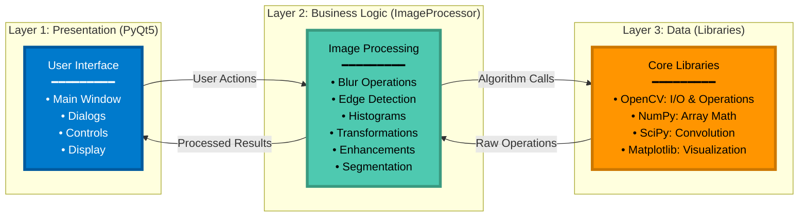
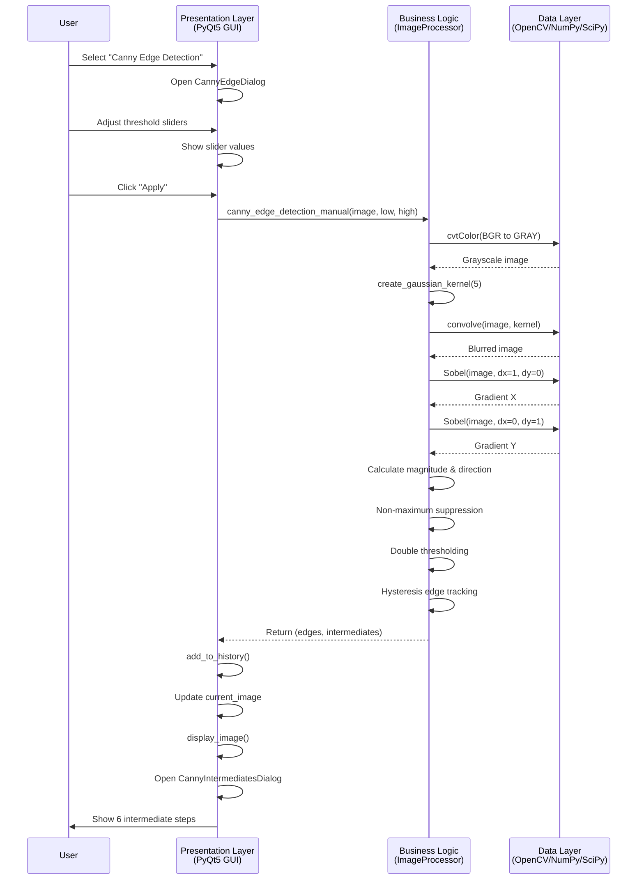

# EduImage System Architecture - Three-Layer Design

## Mermaid Diagram Code

```mermaid
graph TB
    subgraph "Presentation Layer (UI)"
        A[Main Window<br/>PhotoEditorApp]
        B[Menu Bar<br/>File, Edit, Help]
        C[Toolbar<br/>Quick Actions]
        D[Control Panel<br/>Operation Buttons]
        E[Image Display<br/>QLabel with QPixmap]
        F[Status Bar<br/>Image Info]

        G[Dialog Classes]
        G1[BlurDialog<br/>Live Preview]
        G2[CannyEdgeDialog<br/>Threshold Sliders]
        G3[LaplacianEdgeDialog<br/>LoG Parameters]
        G4[CustomKernelDialog<br/>Animated Convolution]
        G5[HistogramAnalysisDialog<br/>PDF/CDF Plots]
        G6[HistogramMatchingDialog<br/>Transform Functions]
        G7[IntermediatesDialog<br/>Step Visualization]

        A --> B
        A --> C
        A --> D
        A --> E
        A --> F
        D --> G
        G --> G1
        G --> G2
        G --> G3
        G --> G4
        G --> G5
        G --> G6
        G --> G7
    end

    subgraph "Business Logic Layer (Image Processing)"
        H[ImageProcessor Class<br/>Static Methods]

        I[Convolution Module]
        I1[convolve2d]
        I2[gaussian_blur]
        I3[average_blur]
        I4[median_blur]
        I5[create_gaussian_kernel]

        J[Edge Detection Module]
        J1[canny_edge_detection_manual]
        J2[laplacian_edge_detection_manual]
        J3[sobel_edge_detection]

        K[Histogram Module]
        K1[Histogram Equalization]
        K2[Histogram Matching]
        K3[PDF/CDF Calculation]

        L[Transformation Module]
        L1[rotate_image]
        L2[flip_image]
        L3[crop_image]
        L4[resize_image]

        M[Enhancement Module]
        M1[enhance_contrast CLAHE]
        M2[adjust_brightness]
        M3[adjust_saturation]
        M4[sharpen_image]

        N[Segmentation Module]
        N1[kmeans_segmentation]
        N2[foreground_background_separation]

        H --> I
        H --> J
        H --> K
        H --> L
        H --> M
        H --> N

        I --> I1
        I --> I2
        I --> I3
        I --> I4
        I --> I5

        J --> J1
        J --> J2
        J --> J3

        K --> K1
        K --> K2
        K --> K3

        L --> L1
        L --> L2
        L --> L3
        L --> L4

        M --> M1
        M --> M2
        M --> M3
        M --> M4

        N --> N1
        N --> N2
    end

    subgraph "Data Layer (Core Libraries)"
        O[OpenCV cv2]
        O1[Image I/O<br/>imread, imwrite]
        O2[Color Conversions<br/>cvtColor]
        O3[Optimized Operations<br/>medianBlur, Sobel]
        O4[Morphology<br/>morphologyEx]
        O5[Segmentation<br/>kmeans, GrabCut]

        P[NumPy]
        P1[Array Operations<br/>ndarray manipulation]
        P2[Mathematical Functions<br/>sqrt, exp, arctan2]
        P3[Vectorized Operations<br/>element-wise ops]

        Q[SciPy]
        Q1[Optimized Convolution<br/>ndimage.convolve]
        Q2[Signal Processing<br/>Fast algorithms]

        R[Matplotlib]
        R1[Histogram Plots<br/>FigureCanvas]
        R2[PDF/CDF Visualization<br/>Interactive plots]

        O --> O1
        O --> O2
        O --> O3
        O --> O4
        O --> O5

        P --> P1
        P --> P2
        P --> P3

        Q --> Q1
        Q --> Q2

        R --> R1
        R --> R2
    end

    %% Connections between layers
    G1 --> H
    G2 --> H
    G3 --> H
    G4 --> H
    G5 --> H
    G6 --> H
    G7 --> H

    I1 --> Q1
    I2 --> Q1
    I3 --> Q1
    I4 --> O3
    I5 --> P2

    J1 --> O2
    J1 --> O3
    J1 --> P1
    J2 --> P1
    J2 --> P2
    J3 --> O3

    K1 --> O
    K2 --> P1
    K3 --> P1

    L1 --> O
    L2 --> O
    L3 --> P1
    L4 --> O

    M1 --> O
    M2 --> O2
    M3 --> O2
    M4 --> O

    N1 --> O5
    N2 --> O5

    G5 --> R
    G6 --> R

    %% Styling
    classDef uiLayer fill:#007acc,stroke:#005a9e,stroke-width:3px,color:#fff
    classDef logicLayer fill:#4ec9b0,stroke:#3a9a80,stroke-width:3px,color:#000
    classDef dataLayer fill:#ff9500,stroke:#cc7700,stroke-width:3px,color:#000

    class A,B,C,D,E,F,G,G1,G2,G3,G4,G5,G6,G7 uiLayer
    class H,I,J,K,L,M,N,I1,I2,I3,I4,I5,J1,J2,J3,K1,K2,K3,L1,L2,L3,L4,M1,M2,M3,M4,N1,N2 logicLayer
    class O,P,Q,R,O1,O2,O3,O4,O5,P1,P2,P3,Q1,Q2,R1,R2 dataLayer
```

## Alternative Simplified View

## Data Flow Diagram

```mermaid
flowchart TD
    START([User Opens Image])

    LOAD[File Dialog<br/>QFileDialog]
    READ[OpenCV imread<br/>BGR Array]
    VALIDATE{Size > 1920px?}
    RESIZE[Prompt Resize<br/>cv2.resize]
    STORE[Store Images<br/>current & original]
    HISTORY[Initialize History<br/>Stack with 20 limit]
    CONVERT[BGR to RGB<br/>cvtColor]
    SCALE[Scale to 75%<br/>for display]
    DISPLAY[Display in QLabel<br/>with QPixmap]

    SELECT[User Selects Operation]
    DIALOG{Needs Parameters?}
    PARAM[Parameter Dialog<br/>with Live Preview]
    PROCESS[ImageProcessor<br/>Apply Algorithm]
    PROGRESS{Long Operation?}
    SHOW_PROGRESS[Show Progress Dialog]
    UPDATE_HISTORY[Add to History Stack]
    UPDATE_DISPLAY[Update Image Display]
    INTERMEDIATE{Has Intermediate Steps?}
    SHOW_STEPS[Show Intermediates Dialog]

    DONE([Operation Complete])

    START --> LOAD
    LOAD --> READ
    READ --> VALIDATE
    VALIDATE -->|Yes| RESIZE
    VALIDATE -->|No| STORE
    RESIZE --> STORE
    STORE --> HISTORY
    HISTORY --> CONVERT
    CONVERT --> SCALE
    SCALE --> DISPLAY

    DISPLAY --> SELECT
    SELECT --> DIALOG
    DIALOG -->|Yes| PARAM
    DIALOG -->|No| PROCESS
    PARAM --> PROCESS
    PROCESS --> PROGRESS
    PROGRESS -->|Yes| SHOW_PROGRESS
    PROGRESS -->|No| UPDATE_HISTORY
    SHOW_PROGRESS --> UPDATE_HISTORY
    UPDATE_HISTORY --> UPDATE_DISPLAY
    UPDATE_DISPLAY --> INTERMEDIATE
    INTERMEDIATE -->|Yes| SHOW_STEPS
    INTERMEDIATE -->|No| DONE
    SHOW_STEPS --> DONE

    style START fill:#4ec9b0,stroke:#3a9a80,stroke-width:3px
    style DONE fill:#4ec9b0,stroke:#3a9a80,stroke-width:3px
    style PROCESS fill:#ff9500,stroke:#cc7700,stroke-width:3px
    style DISPLAY fill:#007acc,stroke:#005a9e,stroke-width:3px
    style UPDATE_DISPLAY fill:#007acc,stroke:#005a9e,stroke-width:3px
```

## Component Interaction Diagram

## Installation Instructions

To use this diagram:

1. **In Markdown viewers** (GitHub, GitLab, etc.): Just view the file, it will render automatically

2. **In Overleaf/LaTeX**: Use the `mermaid` package or convert to image:
   - Visit: https://mermaid.live/
   - Paste the code
   - Export as PNG/SVG
   - Upload to `images/architecture.png`

3. **In VS Code**: Install "Markdown Preview Mermaid Support" extension

4. **Export as Image**:
   - Go to https://mermaid.live/
   - Copy one of the diagrams above
   - Click "Actions" → "PNG" or "SVG"
   - Save as `architecture.png`
